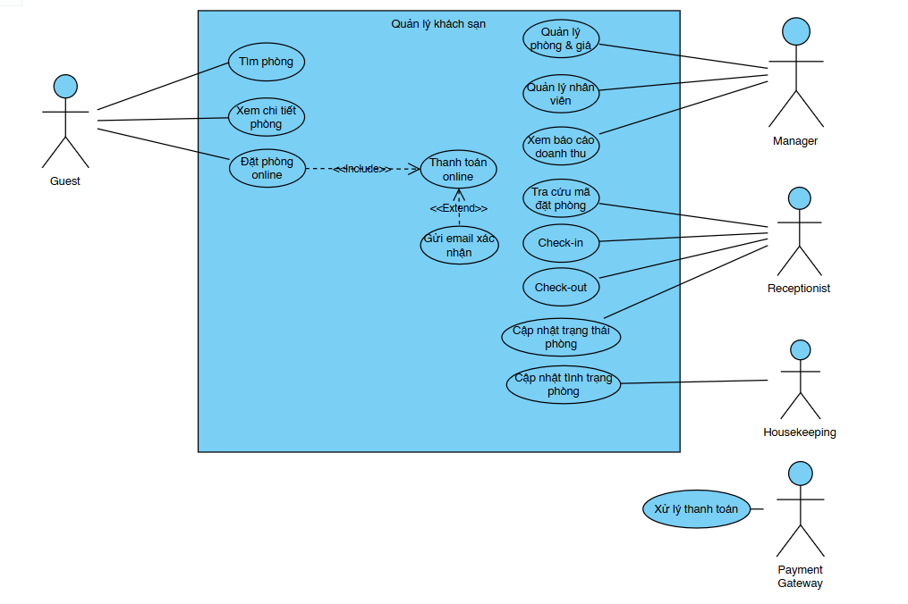
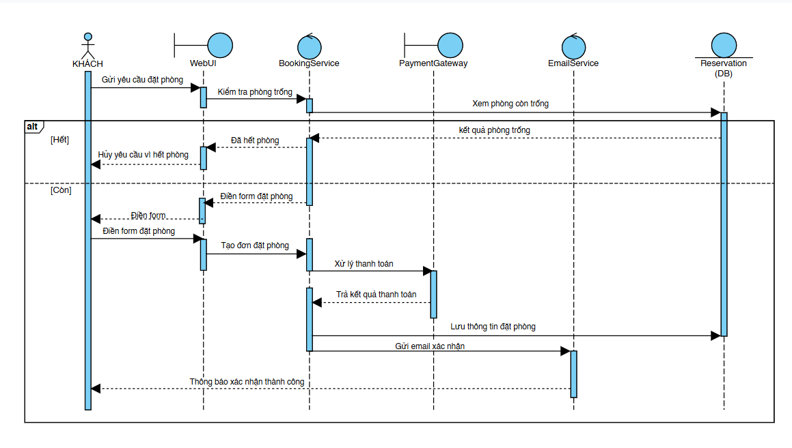
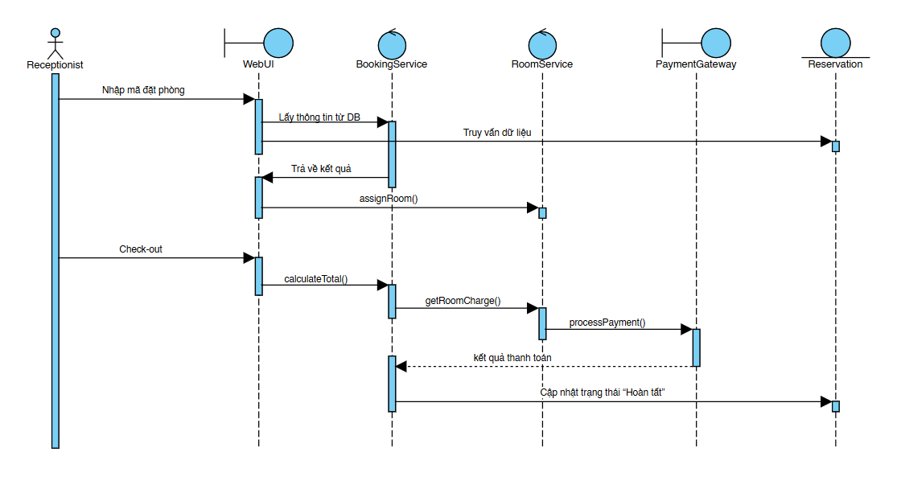
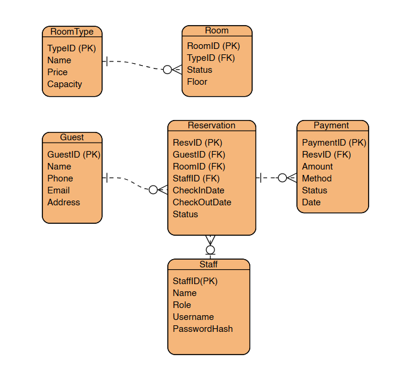

# 🏨 Software Engineering Project - Hotel Booking System

Phân tích & Thiết kế hệ thống đặt phòng khách sạn theo quy trình **UML + Agile Scrum**
## 📖 Giới thiệu dự án

**Hotel Booking System** là dự án mô phỏng quy trình đặt phòng khách sạn trực tuyến, bao gồm các chức năng:
- Đăng ký / Đăng nhập tài khoản người dùng
- Tìm kiếm và xem chi tiết phòng
- Đặt phòng & thanh toán online
- Check-in / Check-out và quản lý phòng

**Mục tiêu dự án:**
- Phân tích & thiết kế hệ thống bằng **UML** (Use Case, Sequence, ERD)
- Tổ chức & quản lý công việc theo **Agile – Scrum** trên **Jira**
- Đồng bộ tài liệu và mô hình lên **GitHub** (README, hình UML, mô tả)
## Thiết kế UML

- 🖼 **Use Case Diagram:** 
- 🖼 **Sequence Diagram (Booking):** 
- 🖼 **Sequence Diagram (Check-in/Check-out):** 
- 🖼 **ERD:**  
  

## Sprint plan
| Sprint | Nội dung chính | Mục tiêu |
|--------:|----------------|-----------|
| **1** | Authentication, Tìm phòng, Xem chi tiết phòng | Hoàn thiện chức năng đăng nhập và tìm kiếm |
| **2** | Đặt phòng & Giữ chỗ | Cho phép khách hàng đặt và xác nhận phòng |
| **3** | Thanh toán & Check-in/out | Quản lý thanh toán, nhận/trả phòng |
| **4** | Báo cáo, Housekeeping, Release | Tổng hợp, kiểm thử và hoàn thiện hệ thống |

## 🔗Jira Project
- **Backlog:**  
  [Xem Backlog tại đây](https://student-team-d23cqpt01.atlassian.net/jira/software/projects/HBS/boards/134)
- **Timeline (Roadmap):**  
  [Xem Timeline](https://student-team-d23cqpt01.atlassian.net/jira/software/projects/HBS/boards/134/timeline?selectedIssue=HBS-7)

---
## Thông tin sinh viên
- **Sinh viên:** HỒ THỊ MAI LINH – N23DCPT030  
- **Lớp:** D23CQPTTK01-N  
- **Môn học:** Nhập môn Công nghệ phần mềm  
- **Giảng viên hướng dẫn:** Thầy Châu Văn Vân  
- **GitHub Repository:**  
  🔗 [https://github.com/chovyjungjihoon-hue/N23DCPT030-Hotel-Booking-system](https://github.com/chovyjungjihoon-hue/N23DCPT030-Hotel-Booking-system)
- **Jira Board:**  
  🔗 [Hotel Booking System Jira](https://student-team-d23cqpt01.atlassian.net/jira/software/projects/HBS/summary)

---

